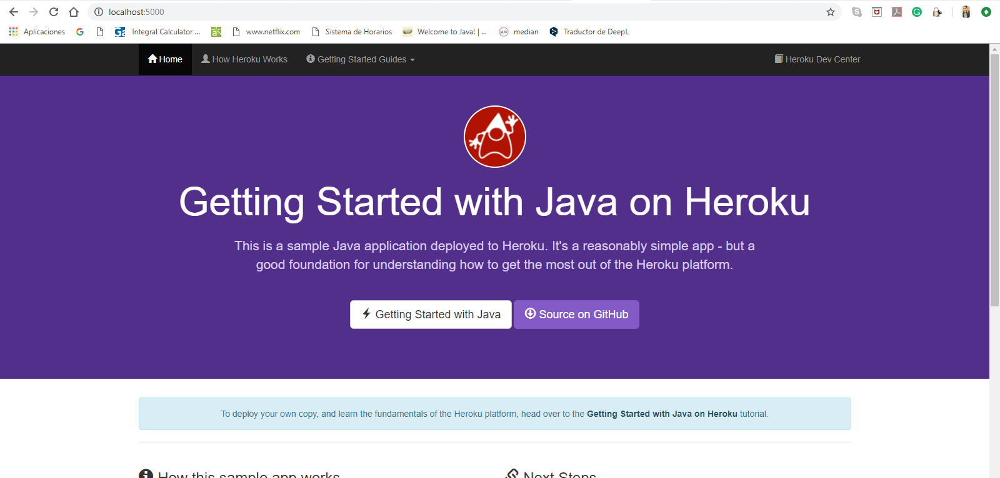
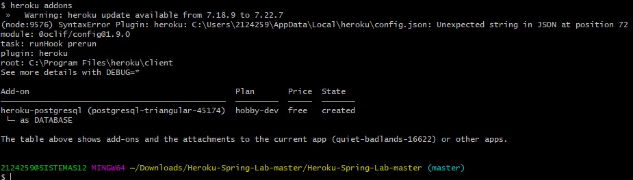
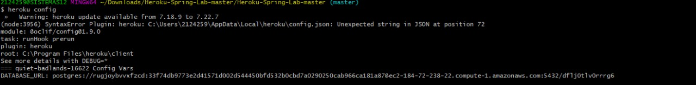
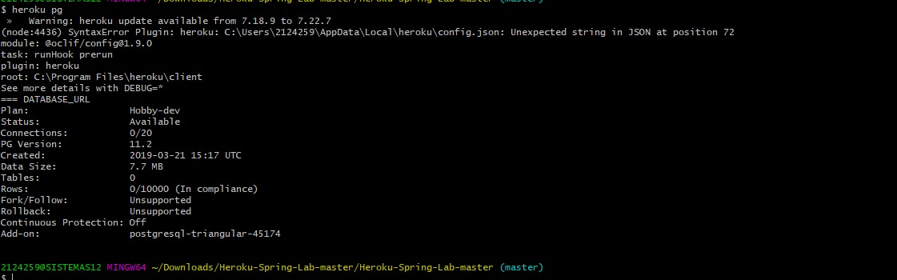

# java-getting-started

A barebones Java app, which can easily be deployed to Heroku.

This application supports the [Getting Started with Java on Heroku](https://devcenter.heroku.com/articles/getting-started-with-java) article - check it out.

[](https://heroku.com/deploy)

## Running Locally

Make sure you have Java and Maven installed.  Also, install the [Heroku CLI](https://cli.heroku.com/).

```sh
$ git clone https://github.com/heroku/java-getting-started.git
$ cd java-getting-started
$ mvn install
$ heroku local:start
```

Your app should now be running on [localhost:5000](http://localhost:5000/).

## Deploying to Heroku

```sh
$ heroku create
$ git push heroku master
$ heroku open
```

## Postman Testing

Use the following postman collection to test the REST API.

[Postman Collection](https://www.getpostman.com/collections/316dc4d4e748fe9810e9) 

## Documentation

For more information about using Java on Heroku, see these Dev Center articles:

- [Java on Heroku](https://devcenter.heroku.com/categories/java)


# lab 8
## Prepare the app
 - 
 - 
 - The aplication run a heroku website
 - The rest services that this website use are GET POST PUT and DELETE and they are used to create services between user and carts through a local repository and a database. 
 -Is the file that heroku uses to run, this file contains an executable `web: java -jar target/heroku-lab-1.0.jar` 
## Deploy the app
 - 
 - 
 - 
 - 
 ## View logs
 - 
 ## Use a database
 - 
 - 
 - 
